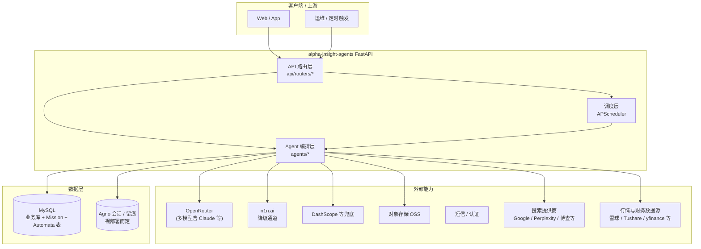
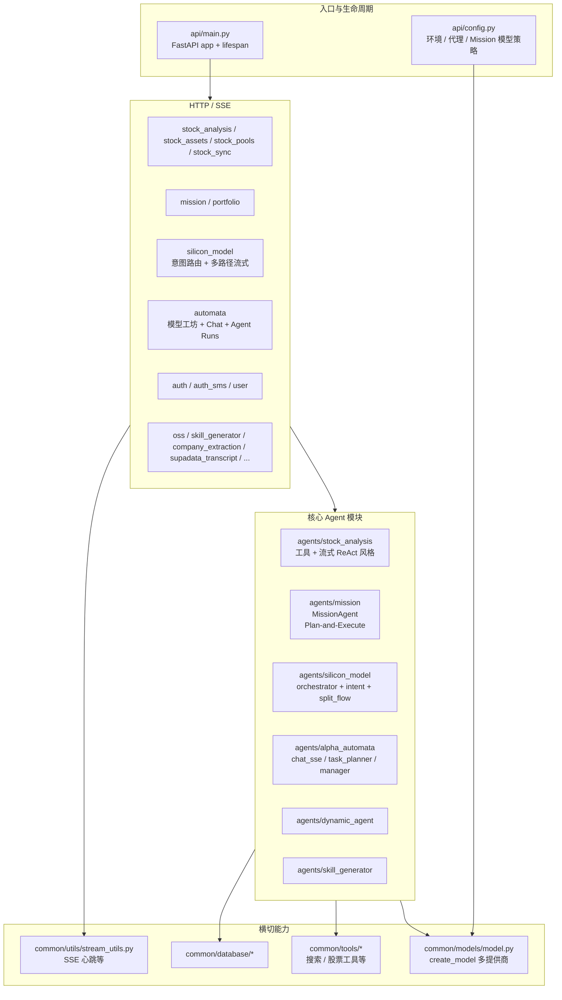
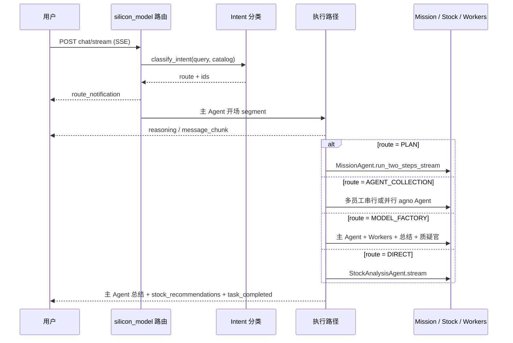
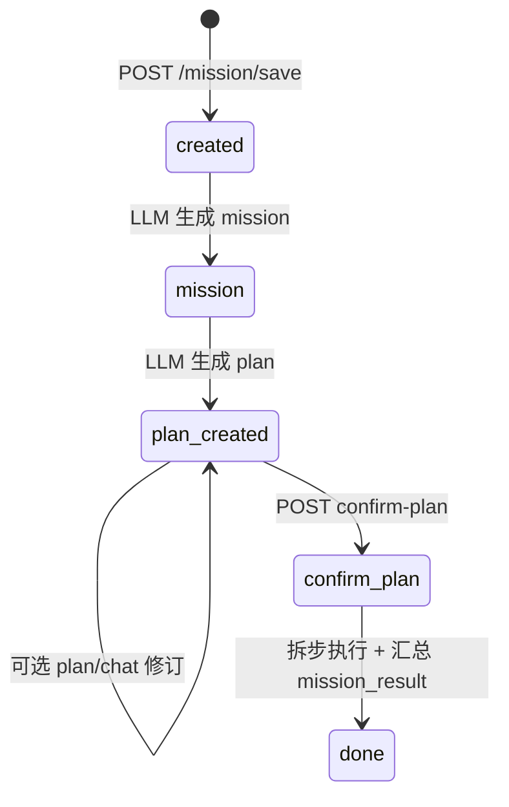
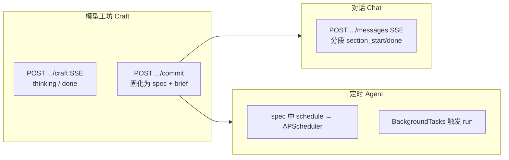

# Alpha Insight Agents：面试展示用系统说明

> **文档用途**：技术面试中的「项目介绍」口述提纲 + 架构白板辅助材料。  
> **阅读顺序建议**：先读 **[0. 面试速览](#0-面试速览)** → **[13. 面试口述稿](#13-面试口述稿)** → 按需展开 **第 4～7 节** 与 **[附录 A](#附录-a-架构图mermaid)**。  
> **维护约定**：路由与模块以 `api/main.py` 注册为准；细节流程以 `docs/MISSION_FLOW_AND_STRUCTURE.md`、`docs/alpha-automata/AUTOMATA_API.md` 为准。

---

## 目录

| 章节 | 内容 |
|------|------|
| [0. 面试速览](#0-面试速览) | 电梯陈述、三层叙事、可量化抓手 |
| [1. 背景与要解决的问题](#1-背景与要解决的问题) | 业务痛点、系统定位 |
| [2. 建设目标与非目标](#2-建设目标与非目标) | 做什么 / 刻意不做什么 |
| [3. 系统边界](#3-系统边界) | 上下游、信任边界 |
| [4. 逻辑架构（分层）](#4-逻辑架构分层) | 职责、依赖方向、与代码目录对应 |
| [5. 核心子系统一览](#5-核心子系统一览) | 子系统矩阵：职责、入口、关键技术 |
| [6. 关键链路走读](#6-关键链路走读) | Mission / 硅基 / Automata 分步说明 |
| [7. 工程化能力矩阵](#7-工程化能力矩阵) | 可观测、容错、成本、数据 |
| [8. 技术选型与权衡](#8-技术选型与权衡) | Why 表 |
| [9. 难点、方案与价值（STAR）](#9-难点方案与价值star) | 面试 STAR 化 |
| [10. Claude 生态借鉴（映射表）](#10-claude-生态借鉴映射表) | 能力对齐 + 代码锚点 |
| [11. 演进方向](#11-演进方向) | 可一句话收尾 |
| [12. 个人贡献 bullet](#12-个人贡献-bullet) | 简历级 |
| [13. 面试口述稿](#13-面试口述稿) | 2 分钟 / 5 分钟 |
| [14. 高频追问与答点](#14-高频追问与答点) | Q&A |
| [15. 术语表](#15-术语表) | 统一用语 |
| [附录 A 架构图（Mermaid）](#附录-a-架构图mermaid) | 上下文 / 分层 / 时序 / 状态机 |

---

## 0. 面试速览

### 0.1 一句话（电梯陈述）

**Alpha Insight Agents** 是一个基于 **FastAPI** 的**多智能体后端**：把大模型能力产品化为「**可规划、可执行、可观测、可调度**」的任务系统，覆盖 **投研分析（股票 + 搜索 + 工具）**、**用户任务（Mission）**、**统一对话入口（硅基路由）**与 **模型工坊 / 定时 Agent（Alpha Automata）**。

### 0.2 三层叙事（建议面试时按此顺序讲）

1. **业务层**：用户要的不是「会聊天的模型」，而是**可交付结果**（分析结论、任务报告、周期巡检产物），且过程要**可解释、可复盘**。  
2. **架构层**：**路由薄、领域厚**——`api/routers` 做协议与校验；`agents/*` 承载编排与 LLM 策略；`common/*` 做模型、工具、流式、数据库横切；`lifespan` 统一拉起 **APScheduler**。  
3. **工程层**：**SSE 事件化**（推理、正文、工具、分段）、**多模型与降级**（OpenRouter 经代理、失败走 n1n 等）、**长任务心跳**，保证「能演示、能上线、能排障」。

### 0.3 可量化 / 可落地的抓手（面试官常问「你具体做了什么」）

- **统一对话入口**：硅基 **意图 → 四路径**（直连股票 / Mission 两步流 / 多员工 / 模型工坊）+ **主 Agent 开场与总结**（`agents/silicon_model/orchestrator.py`）。  
- **复杂任务治理**：Mission **Plan-and-Execute** + 状态机 + `task_results` 分层落库（见 `docs/MISSION_FLOW_AND_STRUCTURE.md`）。  
- **长报告生成**：Automata **constitution + section planner + 并行段 / 依赖段**（`agents/alpha_automata/chat_sse.py`）。  
- **运行时调度**：`api/main.py` **lifespan** 启动 Mission 调度、股票同步、Automata 调度。

---

## 1. 背景与要解决的问题

| 痛点 | 说明 |
|------|------|
| 单次问答不可控 | 复杂任务若纯 ReAct，步骤漂移、难审计、难复现 |
| 多场景入口碎片化 | 股票分析、任务系统、多角色对话、模型工坊若各自为政，前端与运维成本高 |
| 生产环境约束 | 网关超时、模型不稳定、国内外链路差异、需要降级与可观测 |
| 业务要沉淀 | 计划、步骤、结果、会话需要结构化存储，支持列表、详情、重跑、定时 |

---

## 2. 建设目标与非目标

### 2.1 目标（In Scope）

- **任务化**：Mission、Automata Agent 等支持「创建 → 规划/配置 → 执行 → 落库 →（可选）定时再跑」。  
- **编排化**：硅基路由在多路径间选择与组合，支持流式与拆分流（`intent/resolve` + `agent/stream`）。  
- **可观测**：SSE 事件表达中间态（含推理、工具、分段）。  
- **可扩展**：新 Agent 以 `agents/<domain>` + `api/routers` 注册方式接入。

### 2.2 非目标（Out of Scope，面试时可主动声明）

- 本仓库**不是**独立前端工程；与 Web/App 通过 API 协作。  
- **Claude Code** 未作为依赖嵌入；对齐的是其**工作流范式**（规划先行、规范驱动、过程可见），见 **[第 10 节](#10-claude-生态借鉴映射表)**。

---

## 3. 系统边界

```text
[ 客户端 / 上游 ] ──HTTP/SSE──▶ [ alpha-insight-agents ]
                                      │
                    ┌─────────────────┼─────────────────┐
                    ▼                 ▼                 ▼
              [ LLM 网关 ]      [ 搜索 / 行情 ]    [ OSS / 短信 ]
              OpenRouter/n1n…   多数据源           对象存储/认证
                    │                 │                 │
                    └─────────────────┴─────────────────┘
                                      ▼
                               [ MySQL / 会话存储 ]
```

- **信任边界**：鉴权、OSS、短信等按路由与配置启用；具体策略见各 `api/routers` 与 `docs/` 下对接说明。  
- **数据边界**：Mission、portfolio、Automata 等表在 MySQL；Agno 会话是否启用取决于部署（硅基/分析等链路）。

---

## 4. 逻辑架构（分层）

### 4.1 分层模型（自上而下）

| 层级 | 职责 | 典型路径 |
|------|------|----------|
| **L1 接入与协议** | HTTP/SSE、参数校验、统一响应、流式封装 | `api/routers/*.py` |
| **L2 领域编排** | 意图路由、任务状态机、多 Agent 协作、分段生成 | `agents/silicon_model/`、`agents/mission/`、`agents/alpha_automata/` |
| **L3 领域能力** | 单域 Agent（股票、动态 Agent、技能生成等） | `agents/stock_analysis/`、`agents/dynamic_agent/`… |
| **L4 横切** | 模型工厂、工具、DB、流式心跳、配置 | `common/models/model.py`、`common/tools/`、`common/database/`、`api/config.py` |
| **L5 运行时** | 进程生命周期、后台调度 | `api/main.py` lifespan + APScheduler |

**依赖原则（可口述）**：上层可依赖下层；路由层不写复杂 SQL，持久化下沉到 **Repository**（如 `agents/mission/database/`）。

### 4.2 与代码目录的映射（面试白板可写）

```text
api/main.py          → 组装 FastAPI + lifespan（调度器）
api/routers/         → 对外契约（REST/SSE）
api/config.py        → 环境、代理、Mission 默认模型等
agents/<domain>/     → 领域 Agent + 编排 + 部分仓储
common/              → 模型、工具、DB、流式工具
docs/                → 流程与 API 说明（Mission、Automata…）
```

---

## 5. 核心子系统一览

| 子系统 | 解决什么问题 | 主要入口（概念） | 关键技术点 |
|--------|----------------|------------------|------------|
| **Stock Analysis** | 多市场股票分析 + 工具 + 流式 | `api/routers/stock_analysis.py` → `agents/stock_analysis/` | 工具调用、SSE、`ReasoningStep` |
| **Mission** | 用户复杂任务：规划、确认、执行、沉淀 | `api/routers/mission.py` → `agents/mission/agent/core.py` | 状态机、Plan-and-Execute、后台任务、可选 SSE |
| **Silicon Model** | 单入口对话：意图 + 多路径编排 | `api/routers/silicon_model.py` → `agents/silicon_model/orchestrator.py` | 四路径、主 Agent 壳、并行员工、落库 |
| **Alpha Automata** | 业务模型工坊、对话、定时 Agent | `api/routers/automata.py` → `agents/alpha_automata/` | constitution、分段 planner、SSE、`APScheduler` |
| **Portfolio 等** | 投研周边（持仓、巡检等） | `api/routers/portfolio.py` 等 | 与 Mission 调度等协同（见 `api/main.py`） |
| **Auth / User** | 登录与用户标识 | `auth`、`auth_sms`、`user` | JWT、job_number 等业务标识并存 |

---

## 6. 关键链路走读

### 6.1 Mission（用户任务）

1. **保存**：`POST /mission/save` → 写 `tasks_missions` 及附件/历史/技能关联 → **后台**跑 `MissionAgent.run_two_steps`（mission + plan）。  
2. **修订（可选）**：`POST .../plan/chat` 在 `plan_created` 阶段对话改 plan。  
3. **确认执行**：`POST .../confirm-plan` → 状态进入执行 → 拆 `task_mission_plan_steps` → 逐步 LLM → 前缀区分 `SKILL:` / `EXECUTE:` → 汇总 `mission_result`。  
4. **长期任务**：若启用 schedule，在确认等节点注册 **APScheduler**，到期再触发执行。

**面试一句话**：Mission 把「不可控的一次生成」拆成「**可对齐的计划**」和「**可审计的执行**」。

### 6.2 硅基对话（统一入口）

1. **请求进入**：`POST /silicon-model/chat/stream`（SSE + 心跳，见 `stream_with_heartbeat_events`）。  
2. **意图**：`classify_intent` 决定 **Direct / Plan / Agent Collection / Model Factory**。  
3. **可解释路由**：先 `route_notification` 告知用户走哪条路。  
4. **执行**：四路径之一；全局 **主 Agent 开场** 与 **主 Agent 总结** 包住中间路径。  
5. **股票增强**：在相关路径下，若判定股票语境，组装 **stock_cards / stocks** 结构化元数据事件。  
6. **收尾**：`task_completed`；`finally` 中会话与 turn 落库（见 `session_persistence`）。

**面试一句话**：硅基是「**前台一个框**」，后台是「**编排器 + 多域能力**」。

### 6.3 Alpha Automata（模型工坊 + 对话 + 定时）

1. **Craft / Commit**：对话迭代业务模型，**commit** 固化 spec / brief / 版本快照（HTTP 契约见 `AUTOMATA_API.md`）。  
2. **Chat SSE**：在 **constitution** 约束下，planner 生成 **sections JSON**；**独立段并行**、`needsPriors` 为 true 的段在依赖满足后执行。  
3. **Cron Agent**：由 `spec` 推导 `task_plan` 与 schedule，**APScheduler** 注册；`run` 可走 `BackgroundTasks`。

**面试一句话**：Automata 把「长约束 + 长输出」拆成 **可并行的子段任务**，控制时延与结构。

---

## 7. 工程化能力矩阵

| 维度 | 做法 | 可举例说明 |
|------|------|------------|
| **可观测** | SSE 事件：推理、正文、工具、分段、`route_notification` | 前端可还原「模型在干什么」 |
| **容错** | OpenRouter 失败降级 n1n（多模块一致思路）；缺配置路径兜底到 Direct | 「线上不稳时的策略」 |
| **长连接** | SSE 心跳（硅基、Mission 流式等场景） | 防网关 60s 断开 |
| **成本** | Automata `default/cheap/strong` 分层；Mission 按环境 Haiku/Opus | 「贵模型用在刀刃上」 |
| **数据与审计** | `task_results`、硅基 turn、Automata runs | 支持复盘与二次消费 |

---

## 8. 技术选型与权衡

| 决策 | 选择 | 主要原因 |
|------|------|----------|
| Web 框架 | FastAPI | 异步友好、OpenAPI、SSE 生态成熟 |
| Agent 运行时 | agno `Agent` + 流式事件 | 统一流式抽象、`ReasoningStep` 等与 SSE 对齐 |
| 多模型 | OpenRouter 为主 + 降级通道 | 单接入点多模型；结合代理满足链路要求 |
| 队列 → 调度 | pg-boss → APScheduler（Automata 迁移说明） | 与 Python 单体部署模型一致、降低运维组件数 |
| 任务确认 | Mission 显式 confirm | 安全与预期对齐，避免误执行 |

---

## 9. 难点、方案与价值（STAR）

| 难点（Situation/Task） | 方案（Action） | 价值（Result） |
|-------------------------|----------------|----------------|
| 开放域意图易错路由 | 意图模型 + catalog + 可解释 `route_notification` + 缺省降级 | 用户理解「为何走此路」，失败可收窄 |
| 长链路 SSE 易断 | 心跳包装器 + 分阶段接口（intent / agent 拆分） | 演示与生产双可用 |
| 多员工并行交错 | 队列合并异步流或串行简化路径；元数据带 `agent_info` | 前端可区分来源 |
| 长报告结构漂移 | Automata：constitution + JSON section plan + 依赖位 `needsPriors` | 输出结构稳定、并行可控 |
| 模型供应商不稳定 | `create_model` 集中配置 + 代理 + 降级 | 业务连续性 |

---

## 10. Claude 生态借鉴（映射表）

> **表述建议（面试）**：「我们大量通过 OpenRouter 使用 **Claude 谱系**作为默认主力；同时在**交互与工作流**上对齐 Claude / Claude Code 的产品范式，而不是绑定某一闭源客户端。」

| 借鉴维度 | Claude / Claude Code 侧直觉 | 本项目落地 | 代码或文档锚点 |
|----------|------------------------------|------------|----------------|
| 模型梯队 | 快模型迭代 / 强模型终稿 | Mission：非生产 Haiku、生产 Opus；Automata：default/cheap/strong | `api/config.py`、`agents/alpha_automata/config.py` |
| 思考可见 | Extended thinking 类体验 | `ReasoningStep` → SSE `reasoning` / `thinking` | `stock_analysis`、`mission`、`silicon_model`、`alpha_automata/llm.py` |
| 输出形态 | 用户态可读、少裸 JSON | 硅基 Markdown 策略 | `agents/silicon_model/orchestrator.py` |
| 规划先行 | 先 plan 再改 | Mission 流程；硅基 `intent/resolve` | `mission` 路由、`silicon_model` 路由 |
| 规范驱动 | AGENTS.md / 仓库规则 | Automata **constitution** 注入系统提示 | `agents/alpha_automata/chat_sse.py` |
| 子任务并行 | 多文件/多步并行 | section `needsPriors: false` 并行 | 同上 `_derive_section_plan` |
| 批判角色 | 第二意见 | Model Factory **skeptic** 段 | `agents/silicon_model/orchestrator.py` |
| 工具过程可见 | 工具调用 UI | `ToolCallStarted/Completed` 转发 | 股票分析、硅基 agno 流式映射 |

---

## 11. 演进方向

- **更强的路由评测**：离线集 + 线上 shadow，量化意图准确率。  
- **统一 TraceId**：从 HTTP 头贯穿 SSE、DB、调度，缩短排障路径。  
- **策略与权限**：工具级 RBAC、敏感数据脱敏审计。  
- **Agent 评测闭环**：对 Mission / Automata 产出做自动评分与回归。

---

## 12. 个人贡献 bullet

- 负责 / 主导 **多智能体编排**（硅基四路径 + 主 Agent 壳 + 并行与总结 + 质疑段）。  
- 落地 **Mission Plan-and-Execute** 与 **定时调度**，把任务从「一次生成」变为「可确认、可执行、可周期」。  
- 推进 **Automata Python 化迁移**（MySQL + APScheduler），保持 **HTTP/JSON 契约**与前端兼容。  
- 建设 **SSE 事件体系**（推理、工具、分段、心跳）与 **多模型降级**，提升可用性与可观测性。

---

## 13. 面试口述稿

### 13.1 约 2 分钟版本

「我做的是 **Alpha Insight Agents**，一个面向投研和任务场景的 **FastAPI 多智能体后端**。  
业务上，用户需要的不是单次聊天，而是**能交付的结果**，所以核心之一是 **Mission**：先把用户模糊需求整理成 **mission** 和 **plan**，用户确认后再 **按步骤执行**并落库，支持**定时再跑**。  
第二个核心是 **硅基统一入口**：先做**意图分类**，再走四条路——直连股票分析、嵌入 Mission 两步流、多 AI 员工协作、或模型工坊；并且用**主 Agent 开场和总结**把体验串起来，SSE 里能看到**推理、正文和工具过程**。  
第三个是 **Alpha Automata**，做业务模型的工坊对话和长报告生成，用 **constitution** 约束模型，再用 planner 把回答拆成**可并行和可依赖**的 section。  
工程上我强调 **可观测、可降级、可调度**：OpenRouter 走代理、失败降级 n1n，长 SSE 加心跳，**lifespan** 里统一拉起 Mission、股票同步和 Automata 的调度器。」

### 13.2 约 5 分钟版本（在 2 分钟上展开）

在 **第 6 节** 三条链路各加一句「数据落哪里、为何这样拆」；在 **第 7 节** 提一个你亲自踩过的线上问题（如超时、路由误判）及 **第 9 节** 对应方案；在 **第 10 节** 用一句话说明「和 Claude 生态的关系是模型 + 范式，不是依赖某个闭源产品」。

---

## 14. 高频追问与答点

**Q：和 LangGraph / 自研状态机比，你们为什么这样设计？**  
A：当前以 **「明确状态 + 分阶段落库 + 少量编排代码」** 满足业务；LangGraph 适合更重图编排；若步骤依赖图继续变复杂，可渐进引入图编排而不推翻数据模型。

**Q：如何保证计划步骤不被模型带偏？**  
A：**用户确认 plan** 才执行；步骤文本入库；输出用 **前缀协议**（`SKILL:`/`EXECUTE:`）区分类型，降低解析歧义。

**Q：SSE 断了怎么办？**  
A：**心跳**降低空闲断开概率；Mission 等可走 **非流式 + 轮询状态**；硅基支持 **intent 与 agent 拆分**减少单次连接负担。

**Q：多模型怎么选？**  
A：**环境 + 用途分层**：迭代/规划用便宜模型，终稿或生产 Mission 用强模型；统一走 `create_model`，失败走降级通道。

**Q：和 Claude Code 什么关系？**  
A：**未集成** Claude Code；借鉴的是 **规划先行、规范驱动、过程可见、子任务并行** 等工程范式，对应 Mission、Automata、硅基拆分流。

---

## 15. 术语表

| 术语 | 含义 |
|------|------|
| **Mission** | 用户任务域：mission / plan / 执行步骤 / mission_result |
| **硅基 / Silicon Model** | 统一对话路由与多路径编排模块 |
| **Automata** | 业务模型工坊 + 对话 + 定时 Agent 子系统 |
| **Plan-and-Execute** | 先规划再逐步执行的任务范式 |
| **constitution** | Automata 中约束模型行为的长上下文规范文本 |
| **SSE** | Server-Sent Events，流式推送 |
| **APScheduler** | 进程内定时任务调度 |

---

## 附录 A：架构图（Mermaid）

### A.1 系统上下文



### A.2 应用内分层



### A.3 硅基对话（四路径 + 统一壳）



### A.4 Mission 状态机



### A.5 Alpha Automata：工坊 → 对话 → 定时



### A.6 调度组件（`api/main.py` lifespan）

| 组件 | 职责 |
|------|------|
| `MissionScheduleScheduler` | Mission 周期执行、持仓相关 Job 等 |
| `register_stock_sync_jobs` | 多市场股票数据同步 |
| `get_automata_scheduler()` | Automata 侧 cron Agent |

---

## 附录 B：文档与代码索引

| 主题 | 路径 |
|------|------|
| Mission 全流程 | `docs/MISSION_FLOW_AND_STRUCTURE.md` |
| Automata HTTP | `docs/alpha-automata/AUTOMATA_API.md` |
| 应用入口与调度 | `api/main.py` |
| Mission 模型策略 | `api/config.py` |
| 硅基编排 | `agents/silicon_model/orchestrator.py`、`api/routers/silicon_model.py` |
| Automata 分段与 constitution | `agents/alpha_automata/chat_sse.py` |

---

*文档版本：面试展示用结构化重写；细节以代码与专项 docs 为准。*
